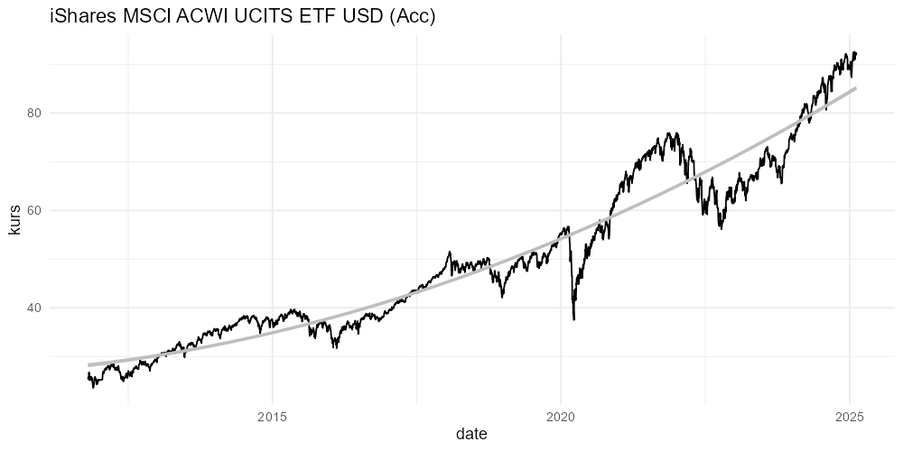
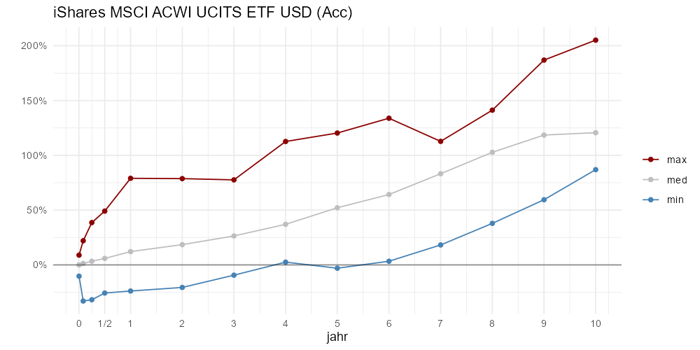
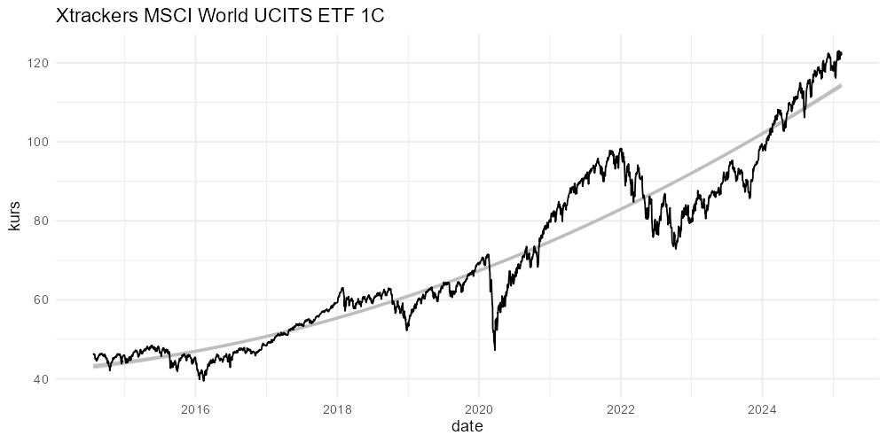
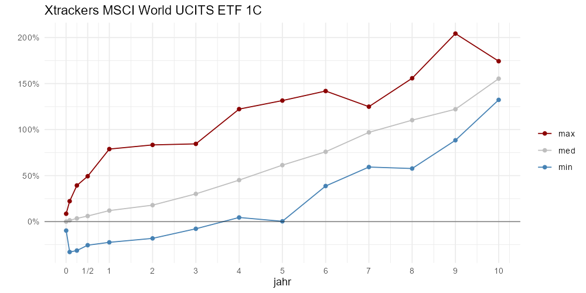

# Profit ETF nach Anlagehorizont

Es werden ETF untersucht, das MSCI mit Schwellenländer und Industrieländer:

<https://finance.yahoo.com/quote/ISAC.L/>

Oder nur das MSCI World mit Industrieländer:

<https://finance.yahoo.com/quote/XDWD.L/>

Es werden 1, 30 & 90 Tage, 1-10 Jahre Anlagehorizante untersucht. Dabei wird das beste Ergebnis, schlechteste Ergebnis und der Median in diesen Anlagedauern dargestellt. Dabei zeigt sich, ab 5 Jahren waren historisch keine Verluste realisierbar. Egal zu welchem Zeitpunkt investiert worden ist.

# iShares MSCI ACWI UCITS ETF USD (Acc) (ISAC.L)

Es werden verschiedene Anlagehorizonte ausgewertet. Für jeden Horizont, wird die minimale, maximale und median Rendite dargestellt. Wobei der Median immer über 0% liegt, wird der minimale Profit ab einer Analgedauer über 5 Jahren Positiv. Tendenziel gilt, je länger die Anlagedauer, desto höher die minimale und median Rendite. Die maximale Rendite stagniert bzw. sinkt in Einzelfällen.

Eine kurze Anlagedauer von weniger als 3 Monate, resultiert in kleine maximale Profite mit grossen potentiellen Verluste.

# Xtrackers MSCI World UCITS ETF 1C (XDWD.L)

In der MSCI WOrld gelten identische Beobachtungen, wie im ACWI mit Schwellenländer. Das liegt an der grossen Überschneidung des Portfolios.

